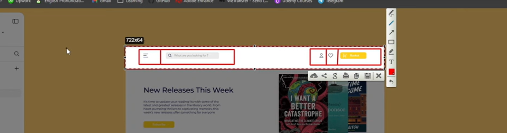
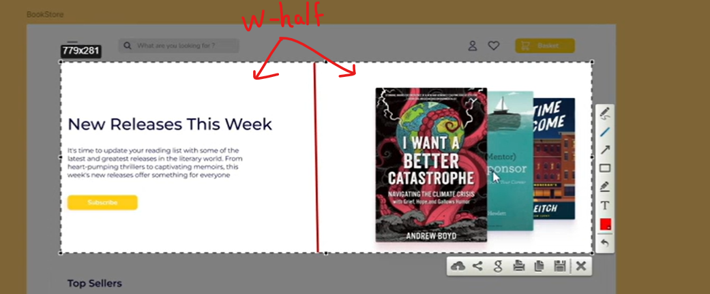

1. Setup client with vite with JS and tailwind.
2. Install react-router-dom and setting up router

-   <Outlet/> - renders the child route elements if it exists

```js
//router.jsx
const router = createBrowserRouter([
    {
        path: "/",
        element: <App />,
        children: [
            {
                path: "/",
                element: <h1>Home</h1>,
            },
        ],
    },
]);

// App.jsx
function App() {
    return (
        <>
            <Outlet />
        </>
    );
}
```

3. Color customization and font customization

```js
//tailwind.config.js
   theme: {
        extend: {
            colors: {
                primary: "#FFCE1A",
                secondary: "#0D0842",
                blackBG: "#F3F3F3",
                Favorite: "#FF5841",
            },
            fontFamily: {
                primary: ["Montserrat", "sans-serif"],
                secondary: ["Nunito Sans", "sans-serif"],
            },
        },
    },
```





```js
function getImageUrl(name) {
    return new URL(`../assets/books/${name}`, import.meta.url);
}

we use import.meta.url, which is a standard way of handling module-relative paths in modern JavaScript.
```

${book?.oldPrice}

-   Optional checking (?)

[Swiper JS](https://swiperjs.com/)

`npm install swiper`

[Navigation](https://swiperjs.com/demos#navigation)
[Response Breakpoints](https://swiperjs.com/demos#responsive-breakpoints)

-   For multi cursor to change click Alt

import news1 from "../../assets/news/news-1.png";
import news2 from "../../assets/news/news-2.png";

Change the name in index.html

```html
<head>
    <meta charset="UTF-8" />
    <link rel="icon" type="image/svg+xml" href="/fav-icon.png" />
    <meta name="viewport" content="width=device-width, initial-scale=1.0" />
    <title>Book Store App</title>
</head>
```

Use static files in public folder, so can easily access here like this.
href="/fav-icon.png"

[React Hook Form](https://react-hook-form.com/get-started)
`npm install react-hook-form`
